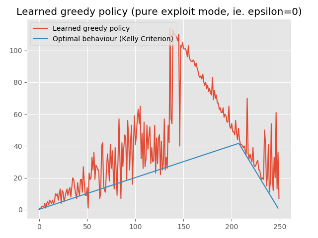
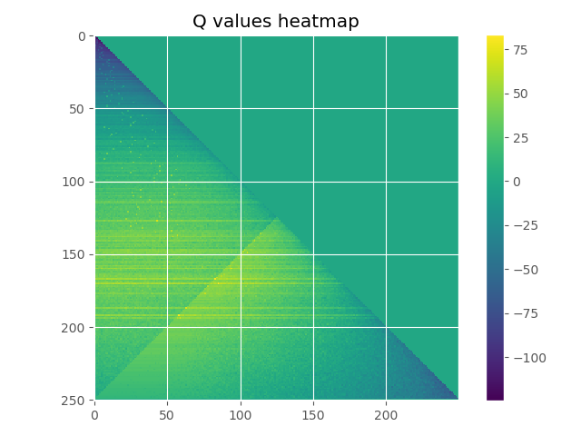
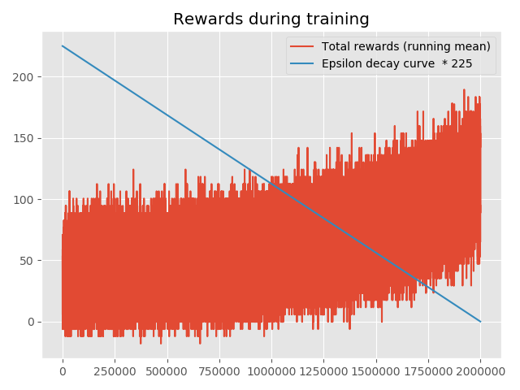
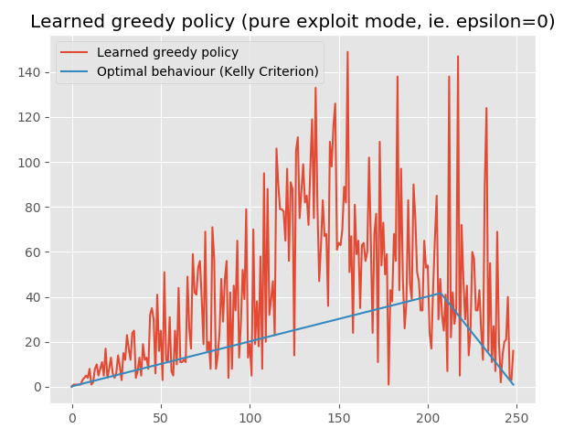
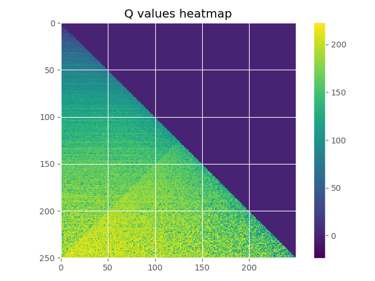

# KellyCriterionRL

From [Wikipedia](https://en.wikipedia.org/wiki/Kelly_criterion):

The Kelly Criterion is to bet a predetermined fraction of assets and can be counterintuitive. In one study,[[5]](https://en.wikipedia.org/wiki/Kelly_criterion#cite_note-5)[[6]](https://en.wikipedia.org/wiki/Kelly_criterion#cite_note-6) each participant was given $25 and asked to bet on a coin that would land heads 60% of the time. Participants had 30 minutes to play, so could place about 300 bets, and the prizes were capped at $250. Behavior was far from optimal. "Remarkably, 28% of the participants went bust, and the average payout was just $91. Only 21% of the participants reached the maximum. 18 of the 61 participants bet everything on one toss, while two-thirds gambled on tails at some stage in the experiment." Using the Kelly criterion and based on the odds in the experiment, the right approach would be to bet 20% of the pot on each throw (see first example below). If losing, the size of the bet gets cut; if winning, the stake increases.

## What's in this repo?

The above paragraph described a bankroll management problem, gave metrics to how most humans perform at it, and presented the optimal solution.

I wondered if a reinforcement learning agent could be trained to perform better at this game than the participants of this study; or if it would work out the optimal strategy (Kelly Criterion) for itself, without being explicitly programmed.

## Training runs

### 6th August 2019

See [this notebook](notebooks/2019-08-06.ipynb)

### 5th August 2019

After a training run of 30 million episodes, with randomly sampled starts

### 2nd August 2019

After an overnight training run of 2 million episodes

